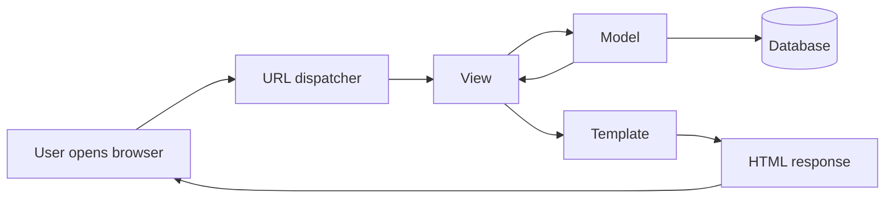

# Django Notes

## What Django Is

Django is a Python web framework used to build secure, scalable, and maintainable web applications.

It follows the MTV pattern:

- Model: manages data and business rules
- Template: handles the UI shown to the user
- View: receives requests and returns responses

MVC is a similar idea, but Django names the parts a little differently. In Django, the View works more like the Controller in MVC.

## Request Flow Diagram



## Simple Way To Understand It

Think of a Django app like a restaurant:

- Model = kitchen and storage, where the data is prepared and saved
- Template = menu and plate design, where the output is presented
- View = waiter, who takes the request and brings back the response
- MVT also know as ninja pattern, because it is fast and efficient. (or) jinja pattern, because it is flexible and powerful.

## Setup Steps

1. Create a virtual environment

```bash
python -m venv env
```

2. Activate it on Windows

```bash
env\Scripts\activate
```

3. Install Django

```bash
pip install django
```

4. Create a project

```bash
django-admin startproject projectname
```

5. Run the development server

```bash
python manage.py runserver
```


## Backend to Database
    
Backend to database it uses the ORM (Object Relational Mapper) to interact with the database. The ORM allows you to define your data models in Python code, and Django will automatically generate the necessary SQL to create and manipulate the database tables.


## Quick Summary

When a user opens a page, Django checks the URL, sends the request to a view, the view may read or update the model, and then Django returns an HTML page using a template.


To render the HTML file, we need to create a template folder in the app directory and then create an HTML file inside it. Then we can use the loader to load the template and render it in the view function.
